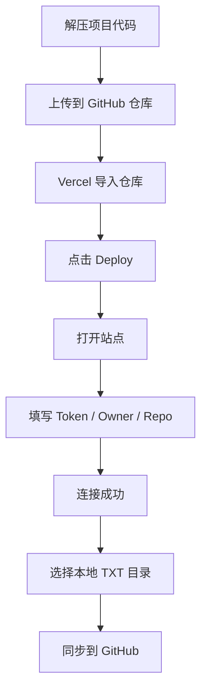

# GitNovelBox 小白版一键部署图文说明

> 目标：让完全没部署过前端项目的人，也能把 GitNovelBox 放到 Vercel 上并跑起来。

---

## 你最终会得到什么

部署完成后，你会得到一个网页地址，例如：

```text
https://你的项目名.vercel.app
```

打开后你可以：

- 连接 GitHub 私有仓库
- 浏览 TXT 文件目录
- 搜索、排序、看属性
- 预览文件正文
- 把本地 TXT 同步到 GitHub

---

## 先准备 4 样东西

### 1. GitHub 账号
用来存项目代码和 TXT 文件。

### 2. Vercel 账号
用来发布网页。

### 3. 当前项目代码文件夹
就是你现在手里的 GitNovelBox 项目。

### 4. GitHub Token
用来让网页访问你的 GitHub 私有仓库。

---

## 整体流程图



---

## 第 1 步：解压项目

把压缩包解压到一个你找得到的位置，例如桌面。

你会看到类似这些文件：

```text
src/
docs/
README.md
package.json
vite.config.js
vercel.json
index.html
```

### 重要提醒

不要上传 `node_modules`。  
如果你看到它，直接忽略就行。

---

## 第 2 步：新建 GitHub 仓库

### 操作位置

GitHub 首页右上角：

```text
+ 号 → New repository
```

### 你要填写

- Repository name：`gitnovelbox-static`
- Visibility：建议 `Private`

然后点击：

```text
Create repository
```

---

## 第 3 步：把项目上传到 GitHub

进入仓库首页后，按这个路径点：

```text
Add file → Upload files
```

然后：

1. 把项目文件拖进去
2. 等上传完成
3. 页面底部填写提交说明，例如：

```text
init project
```

4. 点击：

```text
Commit changes
```

### 你上传后应该看到

```text
.github/
docs/
src/
README.md
package.json
vite.config.js
vercel.json
```

---

## 第 4 步：打开 Vercel 导入项目

### 操作路径

登录 Vercel 后：

```text
Add New → Project
```

然后：

1. 选 GitHub
2. 找到你的 `gitnovelbox-static`
3. 点击：

```text
Import
```

---

## 第 5 步：确认构建配置

导入后通常会自动识别。

你重点看这三项：

```text
Framework Preset: Vite
Build Command: npm run build
Output Directory: dist
```

如果看到这三个基本就可以直接部署。

---

## 第 6 步：点击 Deploy

在 Vercel 页面点：

```text
Deploy
```

等待几十秒到几分钟后，会出现：

```text
Congratulations
```

同时你会拿到一个网址，例如：

```text
https://gitnovelbox-static.vercel.app
```

---

## 第 7 步：打开网页，看一下界面

打开网址后，页面大致长这样：

```text
┌ 顶部：项目标题、仓库状态、统计摘要 ┐
├ 左侧：仓库配置、目录树、统计面板   ┤
├ 中间：搜索、排序、面包屑、文件区     ┤
├ 右侧：属性、预览、日志               ┤
└ 底部：仓库状态栏                     ┘
```

如果页面正常打开，说明部署已经成功了。

---

## 第 8 步：创建 GitHub Token

在 GitHub 里创建 **Fine-grained Personal Access Token**。

### 推荐设置

#### Repository access
只选你要给网页访问的那个仓库。

#### Repository permissions
- Contents：Read and write
- Metadata：Read

创建后复制 Token。

---

## 第 9 步：把仓库信息填到网页里

在页面左侧配置区填写：

- GitHub Token
- Owner
- Repo
- Branch（一般是 `main`）
- Repo Prefix（推荐 `books/`）

然后点击：

```text
测试连接
```

如果成功，再点：

```text
加载远端树
```

---

## 第 10 步：开始像网盘一样使用

### 看远端仓库

连接成功后，你会看到：

- 目录树
- 文件列表
- 卡片视图
- 面包屑导航
- 属性面板
- 文件预览

### 同步本地 TXT

点击：

```text
选择本地目录
```

然后选你的 TXT 小说根目录。

页面会自动扫描 `.txt`，并把结果显示在中间文件区。

接着你可以：

- 单个点击同步
- 或直接点 **一键同步**

同步后，这些文件会出现在 GitHub 仓库中。

---

## 第 11 步：以后怎么更新网页

以后如果你继续改项目代码，只需要：

```text
修改项目文件 → 重新上传到 GitHub → Vercel 自动重新部署
```

不用重新手动配置整个部署流程。

---

## 第 12 步：以后怎么上传 TXT

你有两种方式：

### 方式 A：直接在网页上传 / 同步
- 打开 GitNovelBox 页面
- 选择本地目录
- 点同步

### 方式 B：直接在 GitHub 上传
- 到 GitHub 仓库里手动上传文件
- 回到网页点“加载远端树”

两边显示的是同一份数据。

---

## 小白最容易出错的地方

### 错误 1：上传了 `node_modules`
不要上传。项目上线不需要它。

### 错误 2：Owner / Repo 填反了
- Owner：用户名或组织名
- Repo：仓库名

### 错误 3：Token 权限不够
至少要有：
- Contents：Read and write
- Metadata：Read

### 错误 4：Branch 填错
一般默认就是：

```text
main
```

### 错误 5：部署成功但仓库连接失败
通常不是 Vercel 问题，而是 GitHub Token 或仓库配置问题。

---

## 一眼看懂的最短步骤

```text
1. 新建 GitHub 仓库
2. 上传项目代码
3. 去 Vercel 导入仓库
4. 点 Deploy
5. 打开部署网址
6. 创建 GitHub Token
7. 在网页填 Token / Owner / Repo / Branch
8. 加载远端树
9. 选择本地目录
10. 一键同步
```

---

## 结论

如果你是第一次做部署，最简单的理解方式就是：

- **GitHub：放代码和文件**
- **Vercel：让网页能访问**
- **GitNovelBox：像网盘一样帮你管理 GitHub 文件**

你不需要服务器，也不需要数据库，就能把它跑起来。
