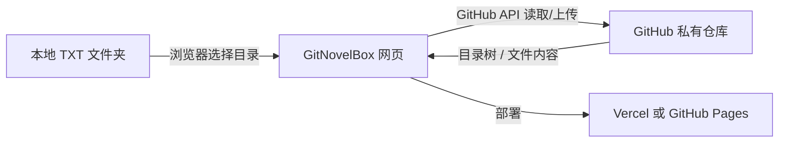

# GitNovelBox 项目介绍

## 项目一句话

GitNovelBox 是一个 **无需自建服务器**、以 **GitHub 仓库** 作为存储后端、以 **Vercel / GitHub Pages** 作为发布平台的 **TXT 小说可视化网盘**。

你可以把它理解成：

> **GitHub 私有仓库的网页资源管理器 + 上传器 + 预览器 + 统计面板**

---

## 项目要解决什么问题

很多人已经把 TXT 小说、文档或轻量文本资料整理在本地目录中，但常见问题是：

- 本地文件夹只能在当前电脑看，跨设备不方便
- GitHub 虽然适合存小体量文本，但原生界面不够像“网盘”
- 想要目录树、搜索、预览、属性和统计，但又不想自建服务器
- 希望上传后 GitHub 能保存，网页里也能直接看到

GitNovelBox 的目标，就是把这些能力用 **一个纯前端项目** 串起来。

---

## 它是什么

GitNovelBox 当前版本是：

- 一个 **Vue 3 + Vite** 的纯静态网页项目
- 一个 **GitHub 私有仓库可视化管理面板**
- 一个适合个人使用的 **TXT 网盘 / 资料库**
- 一个不依赖后端数据库、不依赖自建 API 服务的轻量方案

---

## 它不是什么

GitNovelBox 当前版本不是：

- 不是无限容量网盘
- 不是视频在线播放平台
- 不是大型二进制文件管理系统
- 不是多人协同编辑平台
- 不是带常驻后台同步守护进程的桌面云盘客户端

---

## 核心工作方式



这意味着：

- **GitHub 上传的文件**，网页刷新后可以显示
- **网页同步的文件**，GitHub 仓库里会出现
- **网页显示的内容**，本质上就是 GitHub 仓库内容的可视化结果

---

## 适合谁用

本项目适合：

- 想备份 TXT 小说的个人用户
- 想保留本地目录结构的人
- 希望用网页管理 GitHub 私有仓库文本内容的人
- 不想维护服务器，只想部署后直接用的人
- 希望多设备查看、下载、恢复文本文件的人

---

## 当前已实现的主要能力

### 1. 仓库连接与配置

支持填写并保存：

- GitHub Token
- Owner
- Repo
- Branch
- Repo Prefix
- 文件大小上限
- 若干界面/同步开关

并支持测试连接、读取仓库树。

### 2. 本地目录扫描

支持通过浏览器选择本地目录，递归扫描 `.txt` 文件，并在页面中显示为本地侧数据源。

### 3. GitHub 仓库可视化浏览

支持：

- 左侧目录树
- 面包屑导航
- 中间文件列表
- 卡片 / 列表双视图
- 文件夹筛选
- 文件右键菜单
- 文件夹右键菜单

### 4. 文件同步

支持：

- 单文件同步
- 一键同步
- 仅远端文件识别
- 待上传 / 待更新 / 已同步 状态识别
- 远端下载
- 部分远端删除操作

### 5. 属性与预览

#### 文件属性
- 文件名
- 路径
- 状态
- 来源
- 文件大小
- 更新时间

#### 文件夹属性
- 文件夹总大小
- 内部文件数
- 直接子项数量
- 待同步数量
- 仅远端数量

#### TXT 预览
- 支持本地预览
- 支持远端预览
- 支持常见文本编码兼容

### 6. 搜索、排序与统计

支持按以下范围搜索：

- 全部
- 文件名
- 路径
- 状态

支持按以下字段排序：

- 路径
- 文件名
- 大小
- 状态
- 更新时间
- 来源

支持查看：

- 总文件数
- 当前筛选结果数
- 总大小
- 当前结果大小
- 平均文件大小
- 本地 / 远端体积拆分
- 文件体积分布
- 最大文件 Top 5
- 运行日志

---

## 当前界面布局

```text
顶部：项目名 / 仓库状态 / 当前视图统计
左侧：仓库配置 + 目录树 + 统计面板
中间：工具栏 + 面包屑 + 文件区（列表 / 卡片）
右侧：属性 / 预览 / 日志
底部：状态栏
```

整体风格是：

- 深色控制台 / 网盘面板风格
- 卡片化布局
- 适合桌面浏览器操作
- 更偏“资源管理器 + 网盘后台”，不是纯阅读器首页

---

## 当前设计边界

由于这是 **纯前端静态部署方案**，所以有几个边界需要明确：

1. 关闭网页后，不会后台自动同步
2. 本地文件夹不是操作系统级真实挂载，更多是“浏览器读取后展示”
3. Token 存在浏览器本地，不会经过你的服务器，但仍需最小权限控制
4. GitHub 不支持真正空文件夹，所以创建文件夹使用占位方案实现

---

## 推荐使用方式

推荐把它作为：

- **个人 TXT 资料库**
- **小说目录备份库**
- **轻量多设备同步面板**
- **GitHub 私有仓库可视化管理台**

来使用，而不是把它当成大容量云盘。

---

## 后续方向

后续更适合继续增强的方向包括：

- 全文搜索
- 多选与批量操作
- 拖拽上传
- 阅读模式增强
- 定时同步（页面打开期间）
- 多仓库切换
- IndexedDB 本地缓存

---

## 总结

GitNovelBox 的价值，在于它把：

- **GitHub 私有仓库** 的稳定存储
- **静态部署** 的低运维成本
- **网盘式可视化界面** 的使用体验

组合成了一个面向个人文本管理场景的轻量方案。

如果你想要的是：

> “不用服务器，也能把 GitHub 私库变成一个可浏览、可搜索、可预览、可同步的 TXT 网盘”

那 GitNovelBox 就是为这个目标设计的。
